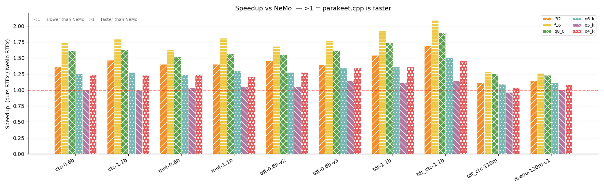
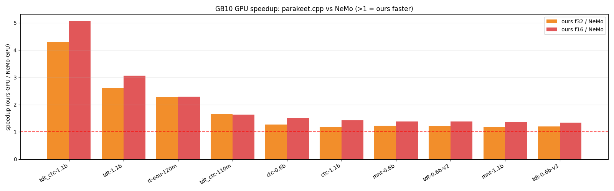
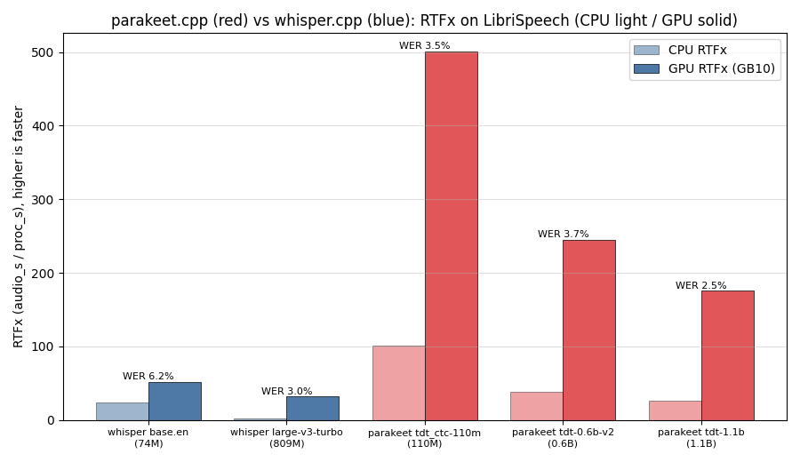

# parakeet.cpp

**Brought to you by the [LocalAI](https://github.com/mudler/LocalAI) team**, the folks behind LocalAI, the open-source AI engine that runs any model (LLMs, vision, voice, image, video) on any hardware, no GPU required.

[](https://huggingface.co/mudler/parakeet-cpp-gguf)
[](LICENSE)
[](https://github.com/mudler/LocalAI)

parakeet.cpp is a C++17 inference port of NVIDIA's [NeMo](https://github.com/NVIDIA-NeMo/NeMo) Parakeet speech-recognition models, built on [ggml](https://github.com/ggml-org/ggml). It gives you fast, dependency-light automatic speech recognition on CPU (and on GPU through ggml's backends), with no Python runtime needed at inference time.

It covers all the offline Parakeet families (CTC, RNNT, TDT, and hybrid TDT-CTC, in 0.6B/1.1B/110M sizes, English plus multilingual v3), each validated at WER 0 against NeMo on every published checkpoint. It also does **cache-aware streaming with end-of-utterance (EOU) detection** for `parakeet_realtime_eou_120m-v1`, where the streaming transcript matches NeMo's cache-aware streaming byte for byte. The full coverage matrix lives in `docs/parity.md`.

It's faster than NeMo's PyTorch runtime on both CPU and GPU, with byte-identical transcripts. The full numbers, methodology, and all the plots are in [benchmarks/BENCHMARK.md](benchmarks/BENCHMARK.md).

<p align="center">
  <a href="benchmarks/BENCHMARK.md"></a>
  <a href="benchmarks/BENCHMARK.md"></a>
</p>

It also runs circles around whisper.cpp on the same audio: the 110M Parakeet is faster than whisper base.en and far faster than large-v3-turbo, while the larger Parakeets match or beat whisper's accuracy (see [benchmarks/BENCHMARK.md](benchmarks/BENCHMARK.md)).

<p align="center">
  <a href="benchmarks/BENCHMARK.md"></a>
</p>

---

## Performance

parakeet.cpp is faster than NeMo's PyTorch runtime on every Parakeet model, on both CPU and GPU, and the transcripts come out byte-identical (WER 0 vs NeMo). Full methodology, all 10 models, quantization tradeoffs, and plots are in [`benchmarks/BENCHMARK.md`](benchmarks/BENCHMARK.md).

### See it run

The same clip fed to parakeet.cpp and to NeMo's own PyTorch runtime on the same GPU. The output comes out byte-for-byte identical, parakeet.cpp just gets there first (slowed down so the sub-100ms race is watchable):


The same race on CPU, against NeMo's own PyTorch runtime: [parakeet.cpp vs NeMo on CPU](benchmarks/media/cpu_nemo_duel.mp4) (about 1.5x faster, still byte-for-byte identical). And vs whisper.cpp turbo, same accuracy and far less compute: [on GPU](benchmarks/media/gpu_whisper_duel.mp4) (about 12x faster) and [on CPU](benchmarks/media/cpu_duel.mp4) (about 27x faster).

CPU numbers (20-core x86, vs NeMo PyTorch-CPU, LibriSpeech test-clean, threads=8; RTFx is audio-seconds over processing-seconds, so higher is faster):

| dtype | size vs f32 | speedup vs NeMo | accuracy |
| ----- | ----------- | --------------- | -------- |
| f32   | 100%        | 1.11 to 1.69x (median 1.40x) | WER 0, byte-identical to NeMo |
| f16   | 57%         | up to 1.70x     | near-lossless |
| q8_0  | 37%         | up to 1.86x     | near-lossless |
| q4_k  | 26%         | n/a             | small, monotonic WER cost |

Peak RAM is also roughly 2x lower than NeMo, and lower still once quantized.

GPU numbers (NVIDIA GB10, Grace-Blackwell, vs NeMo-GPU in the `nvcr.io/nvidia/nemo` container, since NeMo can't run on the host's torch/CUDA stack directly): parakeet.cpp wins on all 10 models, with a median of 1.25x and up to 4.3x on the large TDT/hybrid models. NeMo's TDT greedy decode isn't CUDA-graph accelerated and ours is a lean C++ loop, which is most of that gap. The log-mel front end runs on the GPU via a ggml DFT-matmul graph; the CPU path is unchanged.

---

## Build

Clone with submodules (ggml is vendored at `third_party/ggml`):

```sh
git clone --recursive https://github.com/mudler/parakeet.cpp
cd parakeet.cpp
cmake -B build -DPARAKEET_BUILD_TESTS=ON && cmake --build build -j
```

Use `-DGGML_NATIVE=OFF` for portable or CI builds (it disables host-specific ISA extensions). For the shared library (LocalAI / dlopen):

```sh
cmake -B build-shared -DPARAKEET_SHARED=ON -DPARAKEET_BUILD_CLI=ON
cmake --build build-shared -j
# -> build-shared/libparakeet.so
```

### CMake options

| Option                   | Default | Purpose                                    |
| ------------------------ | ------- | ------------------------------------------ |
| `PARAKEET_BUILD_TESTS`   | OFF     | Compile and register ctest targets         |
| `PARAKEET_BUILD_CLI`     | ON      | Build `parakeet-cli`                       |
| `PARAKEET_SHARED`        | OFF     | Build libparakeet as a shared library      |
| `PARAKEET_GGML_CUDA`     | OFF     | Forward GGML_CUDA to the submodule         |
| `PARAKEET_GGML_METAL`    | OFF     | Forward GGML_METAL to the submodule        |
| `PARAKEET_GGML_VULKAN`   | OFF     | Forward GGML_VULKAN to the submodule       |
| `PARAKEET_GGML_HIP`      | OFF     | Forward GGML_HIP (ROCm) to the submodule   |

To build for a GPU backend, forward its flag, e.g. Apple Metal:

```sh
cmake -B build -DPARAKEET_GGML_METAL=ON && cmake --build build -j
```

The CLI auto-selects the first GPU device the ggml registry reports, so no runtime flag is needed (set `PARAKEET_DEVICE=cpu` to force CPU). Ops the chosen backend has no kernel for run on the CPU automatically, so a model always runs even when one op lacks a GPU kernel. On an Apple M4, Metal is up to about 5x faster than CPU on the larger models; see [Apple Metal](benchmarks/BENCHMARK.md#apple-metal-m4).

---

## Python environment setup

You need this once, for model conversion and validation. It's not needed for inference:

```sh
python3 -m venv .venv
.venv/bin/pip install torch --index-url https://download.pytorch.org/whl/cpu
.venv/bin/pip install -r scripts/requirements.txt   # nemo_toolkit[asr] + gguf
```

NeMo 2.7.3 is the validated version. The anchor checkpoint `nvidia/parakeet-tdt_ctc-110m` (about 440 MB) is downloaded automatically by NeMo on first use.

---

## Converting a model

Convert a HuggingFace or local `.nemo` checkpoint to GGUF:

```sh
# Default (F32), lossless and largest
.venv/bin/python scripts/convert_parakeet_to_gguf.py \
    --model nvidia/parakeet-tdt_ctc-110m \
    --output m.gguf

# F16, about 0.58x the size, WER 0 vs NeMo
.venv/bin/python scripts/convert_parakeet_to_gguf.py \
    --model nvidia/parakeet-tdt_ctc-110m --dtype f16 --output m.gguf

# Q8_0, about 0.39x the size, WER 0 vs NeMo
.venv/bin/python scripts/convert_parakeet_to_gguf.py \
    --model nvidia/parakeet-tdt_ctc-110m --dtype q8_0 --output m.gguf
```

Supported `--dtype`: `f32` (default), `f16`, `q8_0`.

---

## Quantization

The Python `gguf` writer can't produce K-quants (`q4_k`, `q5_k`, `q6_k`), so re-quantize an existing F32 GGUF with the CLI instead:

```sh
parakeet-cli quantize <in.gguf> <out.gguf> <type>
# e.g.
parakeet-cli quantize m.gguf m_q4k.gguf q4_k
parakeet-cli quantize m.gguf m_q6k.gguf q6_k
```

Supported types: `q4_0`, `q5_0`, `q8_0`, `q4_k`, `q5_k`, `q6_k`.

Only the large linear `ggml_mul_mat`-consumed weights (encoder FFN, attention projections, joint enc/pred projections, subsampling output projection) get quantized. The conv, LSTM, featurizer, batch_norm, and bias tensors stay F32. See `docs/quantization.md` for the full policy, allowlist, and measured size and WER per type.

---

## Running inference

```sh
# Default decoder (TDT for hybrid/TDT models, CTC for standalone CTC)
parakeet-cli transcribe --model m.gguf --input audio.wav

# Force a decoder
parakeet-cli transcribe --model m.gguf --input audio.wav --decoder ctc
parakeet-cli transcribe --model m.gguf --input audio.wav --decoder tdt

# Per-word timestamps + confidence: one line per word
#   <start>-<end>  <word>  (<conf>)   (times in seconds)
parakeet-cli transcribe --model m.gguf --input audio.wav --timestamps

# JSON with the flat text plus per-word and per-token timestamps + confidence:
#   {"text":"...","words":[{"w":..,"start":..,"end":..,"conf":..}],
#    "tokens":[{"id":..,"t":..,"conf":..}]}
parakeet-cli transcribe --model m.gguf --input audio.wav --json

# Print model metadata (arch, dims, mel params, vocab size, TDT durations)
parakeet-cli info m.gguf

# Cache-aware streaming (EOU model parakeet_realtime_eou_120m-v1): feeds the WAV
# in the model's chunk schedule, prints partial text incrementally and
# [EOU @ <t>s] / [EOB @ <t>s] event markers, then the finalized tail. Add
# --timestamps to also print per-word [start-end] (conf) lines as words finalize.
parakeet-cli transcribe --model eou.gguf --input audio.wav --stream
```

Timestamps and confidence match NeMo's `transcribe(timestamps=True)` with the `max_prob` confidence method exactly (word offsets to 0.0 s, per-token and per-word confidence within `5e-6`), for both the TDT and CTC heads. See `docs/parity.md`. Word start and end are in seconds (`frame x hop x subsampling / sample_rate`, which works out to 0.08 s/frame here); confidence is the rescaled softmax probability of the emitted token, aggregated per word with NeMo's `min`.

The `parakeet-cli` binary lands at `build/examples/cli/parakeet-cli`.

---

## Batching

Single-clip transcription is the default and needs no flags: every `transcribe` call runs one clip at a time, byte-for-byte identical to before. Batching is an opt-in path for decoding several clips together, which matters when you serve many concurrent requests on a GPU.

The win is on the **decode** side. A transducer (TDT/RNN-T) decodes autoregressively with tiny per-step prediction-LSTM and joint GEMMs; one clip launches hundreds of these matvec-sized kernels and leaves the GPU mostly idle between launches. Decoding N clips together coalesces each step into one batched GEMM, so the device stays busy. On the NVIDIA GB10 this reaches about **10-12x** at batch size 16 (CPU about 3-5x); the encoder is already compute-bound, so batching it gives no throughput win. CTC has no autoregressive decode, so batching does not apply to standalone CTC models. The batched path is bit-identical to running the clips one by one (greedy decode is deterministic). Full numbers and per-model tables are in [`benchmarks/BENCHMARK.md`](benchmarks/BENCHMARK.md#batched-decode-throughput).

Measure it yourself:

```bash
# Decode-only: serial vs batched decode of one clip replicated B times (the win in isolation).
parakeet-cli bench-decode --model <model.gguf> --audio <wav> [--batch-sizes 1,4,8,16] [--threads N] [--reps R] [--json <out>]

# Full transcribe (encoder + decode) over a manifest at several batch sizes.
parakeet-cli bench-batch --model <model.gguf> --manifest <file> [--decoder ctc|tdt] [--threads N] [--batch-sizes 1,4,8] [--json <out>]
```

To batch from code, use the batched entry points (single-clip B=1 is just N=1):

- C++ (`src/model.hpp`): `Model::transcribe_16k_batch(pcms16k, decoder)` and `transcribe_16k_batch_with_timestamps(...)` take N clips of 16 kHz mono float PCM and return N results.
- C-API (`include/parakeet_capi.h`): `parakeet_capi_transcribe_pcm_batch(...)` (N transcripts) and `parakeet_capi_transcribe_pcm_batch_json(...)` (one JSON array of N `{text,words,tokens}` objects). These are what LocalAI's `parakeet-cpp` backend calls to coalesce concurrent requests; it leaves batching off by default and exposes a `batch_max_size` option to opt in.

---

## C-API (`libparakeet.so`)

`include/parakeet_capi.h` defines a flat, exception-free C-API meant for `dlopen` / FFI / LocalAI integration. Build the shared library with `-DPARAKEET_SHARED=ON`:

```c
#include "parakeet_capi.h"

parakeet_ctx *ctx = parakeet_capi_load("model.gguf");  // load ONCE
if (!ctx) { fprintf(stderr, "%s\n", parakeet_capi_last_error(ctx)); return 1; }

char *text = parakeet_capi_transcribe_path(ctx, "audio.wav", 0 /*default*/);
if (text) { printf("%s\n", text); parakeet_capi_free_string(text); }

parakeet_capi_free(ctx);
```

In-memory PCM:
```c
char *text = parakeet_capi_transcribe_pcm(ctx, samples, n_samples,
                                          sample_rate, 0 /*default*/);
```

Timestamps and confidence as JSON (matches NeMo `timestamps=True` + `max_prob`):
```c
char *json = parakeet_capi_transcribe_path_json(ctx, "audio.wav", 0 /*default*/);
// {"text":"...",
//  "words":[{"w":"Well,","start":0.480,"end":0.640,"conf":0.7859}, ...],
//  "tokens":[{"id":639,"t":0.480,"conf":0.9969}, ...]}
if (json) { printf("%s\n", json); parakeet_capi_free_string(json); }
```
`start`/`end`/`t` are in seconds; `conf` is the rescaled softmax probability of the emitted token in `(0,1]` (a word's `conf` is the `min` over its tokens).

### Streaming (cache-aware EOU model)

For `parakeet_realtime_eou_120m-v1`, a streaming session decodes 16 kHz mono f32 PCM as it arrives, returning newly-finalized text and signalling EOU/EOB events:

```c
parakeet_stream *s = parakeet_capi_stream_begin(ctx);
int eou = 0;
char *t = parakeet_capi_stream_feed(s, pcm, n_samples, &eou); // "" if none yet
if (t) { printf("%s", t); parakeet_capi_free_string(t); }
if (eou) printf(" [EOU]");
// ...feed more chunks...
char *tail = parakeet_capi_stream_finalize(s);                // flush the tail
if (tail) { printf("%s\n", tail); parakeet_capi_free_string(tail); }
parakeet_capi_stream_free(s);
```

`<EOU>` (end-of-utterance) and `<EOB>` (backchannel) are stripped from the text and surfaced via `*eou_out` (the CLI `--stream` prints them as `[EOU @ <t>s]` markers). The streaming transcript matches NeMo's cache-aware streaming exactly, and `finalize` flushes the end-of-stream tail without fabricating an `<EOU>` that NeMo would not emit.

The LocalAI backend (in the LocalAI repo) dlopens `libparakeet.so` and uses these symbols directly: the offline `parakeet_capi_transcribe_*` / `parakeet_capi_transcribe_path_json` and the streaming `parakeet_capi_stream_*`. See `include/parakeet_capi.h` for the full API. The C++ streaming session (`pk::StreamingSession`) also exposes per-word timestamps and confidence as words finalize, via `drain_words()` alongside the EOU events, which the CLI `--stream --timestamps` path prints.

---

## Model coverage

See `docs/parity.md` for the full coverage matrix. In short:

| Family | Representative checkpoints | Heads | WER vs NeMo |
| --- | --- | --- | --- |
| Hybrid TDT+CTC | `parakeet-tdt_ctc-110m`, `parakeet-tdt_ctc-1.1b` | TDT + CTC | 0.0 |
| TDT (hybrid) | `parakeet-tdt-0.6b-v2`, `parakeet-tdt-0.6b-v3` (multilingual) | TDT | 0.0 |
| Pure TDT | `parakeet-tdt-1.1b` | TDT | 0.0 |
| CTC | `parakeet-ctc-0.6b`, `parakeet-ctc-1.1b` | CTC | 0.0 |
| RNNT | `parakeet-rnnt-0.6b`, `parakeet-rnnt-1.1b` | RNNT | 0.0 |

All 10 published offline checkpoints are validated at WER 0 vs NeMo 2.7.3. Sizes: 110M (512/17 layers), 0.6B (1024/24), 1.1B (1024/42).

Cache-aware streaming and EOU (`parakeet_realtime_eou_120m-v1`) is implemented too: `layer_norm` plus causal conv, causal subsampling, chunked-limited attention, per-layer conv/attention caches, carried RNN-T decoder state, and `<EOU>`/`<EOB>` events. The streaming transcript matches NeMo's cache-aware streaming byte for byte. See `docs/parity.md` (the Streaming + EOU section).

---

## Running tests

Model-independent (run anywhere):

```sh
ctest --test-dir build --output-on-failure -LE model
```

Model-dependent (need venv + checkpoint):

```sh
export PARAKEET_TEST_GGUF=/tmp/pk110m.gguf
export PARAKEET_TEST_BASELINE=/tmp/baseline.gguf
export PARAKEET_TEST_BASELINE_SPEECH=/tmp/baseline_speech.gguf
ctest --test-dir build --output-on-failure
```

Tests labelled `model` return exit code 77 (ctest SKIP) when their required env vars are absent, so they never break a CI environment that has no model.

---

## Roadmap / TODO

- **Tune the GPU encoder kernels.** On the GB10 GPU, parakeet.cpp is faster than NeMo on all 10 models (median 1.25x, up to 4.3x), but the gains are smallest on the pure-encoder CTC models (around 1.2x), because ggml's generic CUDA conv/attention kernels still trail NeMo's tuned cuDNN. Closing that gap (better conv1d and flash-attention paths for the FastConformer encoder) is the main remaining GPU headroom. The log-mel already runs on the backend (`GpuMel`); the CPU path is unaffected.

---

## Why parakeet.cpp

NeMo is a great training framework, but running Parakeet just for inference drags in a heavy Python/PyTorch stack. parakeet.cpp is a from-scratch C++17/ggml port focused purely on inference:

- **No Python at inference.** A single `libparakeet.so` (or static lib) behind a flat C API (`include/parakeet_capi.h`), easy to embed from C, C++, Go, or Rust.
- **Faster than NeMo** on CPU and GPU (see [Performance](#performance)), with byte-identical output.
- **Small and portable.** GGUF models with f16 / q8_0 / K-quant variants, running on CPU and any ggml GPU backend (CUDA, Metal, Vulkan, HIP).
- **Full family coverage.** CTC, RNNT, TDT, hybrid TDT-CTC, multilingual, and cache-aware streaming with EOU, all validated at WER 0 vs NeMo.

---

## Citation

If you use parakeet.cpp, please cite this repository and the original models:

```bibtex
@software{parakeet_cpp,
  title  = {parakeet.cpp: a C++/ggml inference engine for NVIDIA Parakeet ASR},
  author = {Di Giacinto, Ettore and Palethorpe, Richard},
  url    = {https://github.com/mudler/parakeet.cpp},
  year   = {2026}
}
```

The Parakeet models are by NVIDIA NeMo ([NVIDIA-NeMo/NeMo](https://github.com/NVIDIA-NeMo/NeMo)).

## Author

Ettore Di Giacinto ([@mudler](https://github.com/mudler)).

## License

parakeet.cpp is released under the [MIT License](LICENSE). The model weights are governed by NVIDIA's original Parakeet model licenses, so check each model card on HuggingFace.
